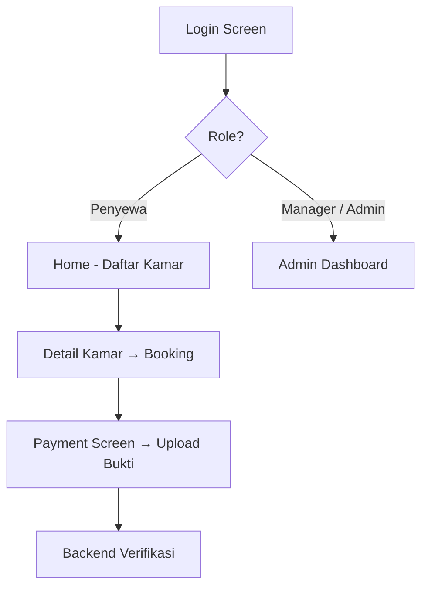
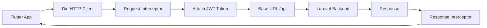
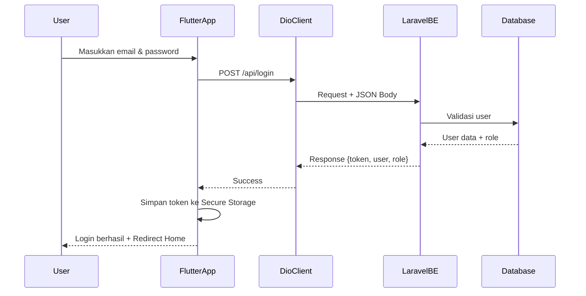
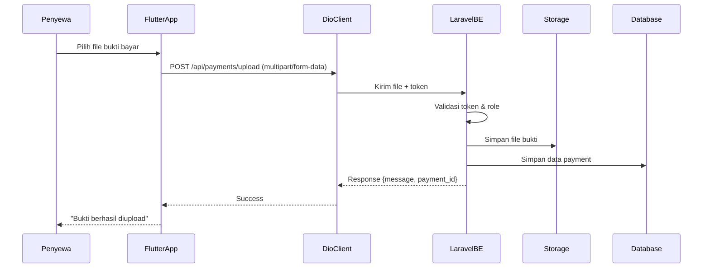

#  Rumah Sewa Biru Laut — Frontend

<div align="center">

**Aplikasi Frontend (Flutter Web) untuk Sistem Sewa Rumah Kos Biru Laut**

🟢 **Status**: Sedang Development | Terintegrasi dengan Laravel Backend

[🌐 Live Demo](https://rumahsewabl-fe.web.app) · [📋 Backend Repo](https://github.com/Mikhael-agung/RumahSewaBL-BE) · [⚙️ Setup](#️-setup--instalasi)

</div>

---

##  Informasi Project

| Field | Detail |
|---|---|
| **Project** | Rumah Sewa Biru Laut |
| **Platform** | Flutter Web (Mobile-ready) |
| **Backend** | Laravel 13 + JWT |
| **Database** | MySQL |
| **Deployment** | Firebase Hosting |

---

##  Alur Aplikasi



---

##  Flow Koneksi ke Backend

### Arsitektur Koneksi



### Cara Kerja

1. **Dio Instance (Singleton)** — dikelola di `lib/core/network/dio_client.dart`
2. **Request Interceptor** — otomatis attach `Authorization: Bearer <token>` + set `Content-Type: application/json`
3. **Response Interceptor** — handle error (401, 403, 422) dan refresh token logic
4. **Base URL** — dikelola terpusat di `lib/core/constants/api_constants.dart`

```dart
class ApiConstants {
  static const String baseUrl =
      'https://rumahsewabl-be-production.up.railway.app/api';

  // Auth
  static const String login   = '/login';
  static const String logout  = '/logout';

  // Payment
  static const String uploadPayment   = '/payments/upload';
  static const String paymentHistory  = '/payments/history';
  static const String pendingPayments = '/payments/pending';
}
```

---

### Sequence Diagram — Login Flow



### Sequence Diagram — Upload Bukti Pembayaran



### Flow Authentication

```
User Login
  → Backend return: token + user data + role
  → Token disimpan di flutter_secure_storage
  → Setiap request protected auto-attach token
  → Jika 401 Unauthorized → Redirect ke Login Screen
```

---

## ⚙️ Setup & Instalasi

```bash
git clone https://github.com/Mikhael-agung/RumahSewaBL-FE.git
cd RumahSewaBL-FE

flutter pub get
flutter run -d chrome
```

> Ubah `baseUrl` sesuai environment (development/production) di `ApiConstants`.

---

## Struktur Folder

```
lib/
├── core/
│   ├── constants/       # ApiConstants, AppConstants
│   ├── network/         # Dio client + interceptors
│   ├── utils/
│   └── theme/
├── features/
│   ├── auth/
│   ├── payment/
│   ├── room/
│   └── admin/
├── shared/
└── main.dart
```

---

## Role & Akses

| Role | Fitur Utama |
|---|---|
| `penyewa` | Booking, Upload Bukti Bayar, Riwayat |
| `manager` | Verifikasi Pembayaran |
| `administrator` | Full Management |

---

##  Progress Development

### Sprint 1 — Minggu 10

- [x] Auth + JWT Integration
- [x] Payment Upload & History
- [x] Dio Client + Interceptor
- [x] Responsive UI

###  Next Sprint

- [ ] Booking System
- [ ] Admin Dashboard
- [ ] Notifikasi

---

<div align="center">

*Last updated: 24 Mei 2026*

</div>
